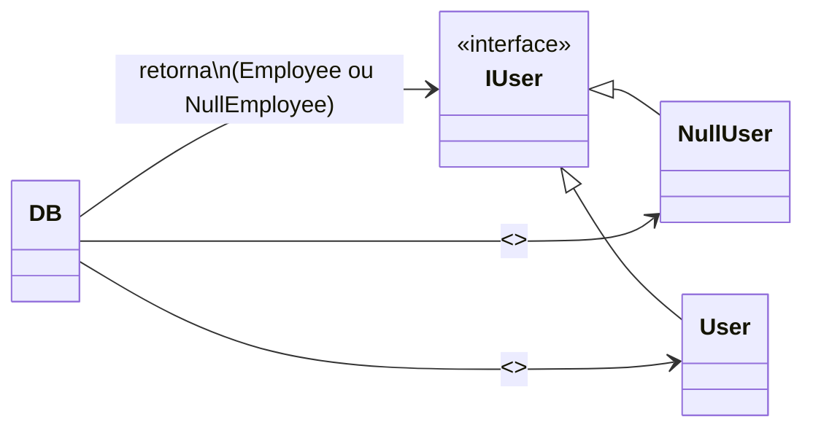

# **Padrão Null Object — Problema e Solução**

O padrão **Null Object** surgiu para resolver um problema extremamente comum no desenvolvimento de software:
a **presença de verificações de `null` espalhadas pelo código**, causando fragilidade e má legibilidade.

---

## Problema: O sistema inteiro precisa saber lidar com `null`

Em muitas aplicações, quando um método tenta buscar um registro que não existe, ele retorna `null`.
Isso força o programador a escrever repetidamente:

```java
User user = repository.findById(id);
if (user != null) {
    user.notify("Olá!");
}
```

Esse modelo cria diversos problemas estruturais:

### 1. **Código poluído e difícil de manter**

A lógica do sistema é contaminada por dezenas ou centenas de verificações de `null`.

### 2. **Alto risco de NullPointerException**

Basta uma verificação esquecida para o sistema quebrar em produção.

###  3. **Regra de ausência espalhada pela aplicação**

Cada parte do código decide “do seu jeito” o que fazer quando algo não existe.

### 4. **Duplicação de comportamento**

Cada módulo implementa sua própria forma de tratar ausência de dados.

Em outras palavras:

### *Quando um código retorna null, quem chama precisa resolver o problema.*

E isso é ruim.

---

## Solução: Representar a ausência com um objeto real

O padrão **Null Object** resolve o problema ao substituir `null` por um objeto legítimo —
um objeto que **implementa a mesma interface**, mas cujo comportamento é neutro.

### Diagrama (mermaid) — Estrutura do Padrão Null Object



Em vez de:

* retornar `null`
* forçar verificações de segurança em quem consome

Você retorna:

```java
return new NullUser();
```

Esse objeto:

✔ implementa a mesma interface que `User`
✔ nunca lança NPE
✔ responde a métodos de forma segura
✔ encapsula a lógica de “ausência”
✔ melhora a coesão e reduz acoplamento

E o código consumidor fica limpo:

```java
IUser user = repository.findById(id);
user.notify("Olá!"); // Funciona com User ou NullUser
```

Sem `if`.
Sem NPE.
Sem duplicação de lógica.

---